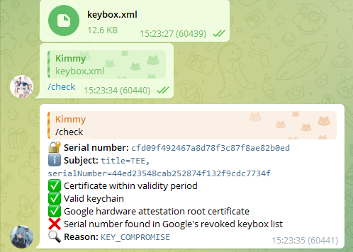

# Keybox Checker
[](https://github.com/KimmyXYC/KeyboxChecker/actions/workflows/ruff.yaml)
[](https://github.com/KimmyXYC/KeyboxChecker/actions/workflows/docker-ci.yaml)
## 部署 / Deployment

- 下载源码。 Download the code.
```shell
git clone https://github.com/KimmyXYC/KeyboxChecker.git
cd KeyboxChecker
```

- 复制配置文件。 Copy configuration file.
```shell
cp .env.exp .env
```

- 填写配置文件。 Fill out the configuration file.
```
TELEGRAM_BOT_TOKEN=xxx
# TELEGRAM_BOT_PROXY_ADDRESS=socks5://127.0.0.1:7890
```

### 本地部署 / Local Deployment
- 安装依赖并运行。 Install dependencies and run.
```shell
pip3 install pdm
pdm install
pdm run python main.py
```
- 使用 PM2 守护进程。 Use PM2 to daemonize the process.
```shell
pm2 start pm2.json
pm2 monit
pm2 restart pm2.json
pm2 stop pm2.json
```

### Docker 部署 / Docker Deployment
- 使用预构建镜像。 Use pre-built image.
```shell
docker run -d --name keyboxchecker --env-file .env ghcr.io/kimmyxyc/keyboxchecker:main
```

## 使用 / Usage
私聊发送 keybox.xml 文件 或 对 keybox.xml 文件回复 /check  
Send the keybox.xml file in the private chat or reply with /check to keybox.xml file.


